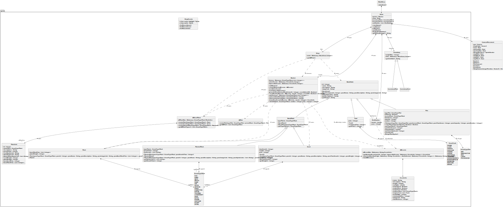

<a name="readme-top"></a>

<!-- LOGO DU PROJET -->
<div align="center">
    
<h3 align="center">MARS'GRICULTURE</h3>
</div>


<!-- SOMMAIRE -->
<details>
  <summary>Sommaire</summary>
  <ol>
    <li><a href="#projet-T3">Projet T3</a></li>
    <li><a href="#capture-decran">Captures d'écrans</a>
      <ul>
          <li><a href="#uml">UML</a></li>
          <li><a href="#map">MAP</a></li>
          <li><a href="#differentes-fenetres">Différentes fenêtres</a></li>
      </ul>
    </li>
    <li><a href="#lien-de-telechargement">Lien de téléchargement</a></li>
    <li><a href="#procedures-dinstallation-et-dexecution">Procédures d'installation et d'exécution</a>
        <ul>
            <li><a href="#procedures-dinstallation">Procédure d'installation</a></li>
                <ul>
                    <li><a href="#windows">Sous Windows</a></li>
                    <li><a href="#linux">Sous Linux</a></li>
                </ul>            
            <li><a href="#procedures-dexecution">Procédure d'execution</a></li>
        </ul>
    </li>
        <li><a href="#licence">Licence</a></li>
    <li><a href="#meta-todo">Méta-Todo</a></li>
  </ol>
</details>


<!-- PROJET T3 -->
## Projet T3
<a name="projet-T3"></a>

Nom du groupe : LE groupe  
Code du groupe : PEC22-T3-A  
Participants :
* FLU Charly
* HOOGLAND Paolo
* MARQUE Elise
* NIEDERBERGER Léo

Lien des consignes : [https://git.unistra.fr/T234/T3](https://git.unistra.fr/T234/T3)
_Projet_ : Producteurs et consommateurs : les mécanismes du marché face aux changements de contexte

<!-- CAPTURE D'ECRAN -->
<a name="capture-decran"></a>

## Captures d'écrans
### UML
<a name="uml"></a>

<div align="center">
    
<h6 align="center">Diagramme de classe</h6>
</div>

Au début du projet, nous avons décidé de faire un UML pour voir comment allait être agencé le code, et comment étaient relié les classes.
Ce diagramme de classe nous a permis de nous répartir le code des classes.

### MAP
<a name="map"></a>

<div align="center">
    
<h6 align="center">Début de game</h6>
</div>

<div align="center">
    
<h6 align="center">Les champs</h6>
</div>

<div align="center">
    
<h6 align="center">Le magasin</h6>
</div>

<div align="center">
    
<h6 align="center">Le marché</h6>
</div>

<div align="center">
    
<h6 align="center">L'inventaire des graines</h6>
</div>

<div align="center">
    
<h6 align="center">L'inventaire des plantes</h6>
</div>

<div align="center">
    
<h6 align="center">Les notifications</h6>
</div>

<div align="center">
    
<h6 align="center">Les jours et l'argent du joueur</h6>
</div>

<div align="center">
    
<h6 align="center">Le menu</h6>
</div>

### Différentes fenêtres
<a name="differentes-fenetres"></a>
<div align="center">
    
<h6 align="center">Le magasin</h6>
</div>

<div align="center">
    
<h6 align="center">Le marché</h6>
</div>

<div align="center">
    
<h6 align="center">L'inventaire des graines</h6>
</div>

<div align="center">
    
<h6 align="center">L'inventaire des plantes</h6>
</div>

<div align="center">
    
<h6 align="center">Les notifications</h6>
</div>

<div align="center">
    
<h6 align="center">Demande au joueur s'il est sûr de quitter</h6>
</div>

<p align="right">(<a href="#readme-top">back to top</a>)</p>


<!-- LIEN DE TELECHARGEMENT -->
<a name="lien-de-telechargement"></a>

## Lien de téléchargement


<p align="right">(<a href="#readme-top">back to top</a>)</p>


<!-- PROCEDURES D'INSTALLATION ET D'EXECUTION -->
<a name="procedures-dinstallation-et-dexecution"></a>

## Procédures d'installation et d'exécution
<a name="procedures-dinstallation"></a>
### Procédures d'installation
<a name="procedures-dinstallation"></a>
#### Sous Windows
<a name="windows"></a>
#### Sous Linux
<a name="Linux"></a>

<!-- Si besoin
* unity
  ```sh
  apt install jesaispas
  ```

1. blabla [https://example.com](https://example.com) -->

  
### Procédures d'exécution
<a name="procedures-dexecution"></a>

<p align="right">(<a href="#readme-top">back to top</a>)</p>


<!-- LICENCE -->
<a name="licence"></a>

## Licence

Les licences de type BSD (Berkeley Software Distribution License) ne nous ont pas intéressées, car elles n’imposent pas la citation de l’auteur lors de la redistribution.

Nous avons cherché si la licence devait être copyleft. “Le copyleft est un cadre permettant de faire d’un programme un logiciel libre et d’exiger que les versions modifiées ou étendues deviennent elles aussi des logiciels libres.” (source : gnu.org). Nous en avons convenu que la licence doit être copyleft.

La licence Apache 2.0 ne sera pas sélectionnée car c’est pour les gros programmes et nous avons décidé que notre programme n’est pas très volumineux.

La licence SAAS (Software as a Service)  est une licence pour commercialiser un logiciel en tant qu’application accessible à distance comme un service, par internet. Ce qui n’est pas notre cas.

Nous ne prenons pas les licences GNU qui concernent les bibliothèques.

La licence GNU GPL(General Public License) est une licence en application du “copyleft”, elle nous dit que toute personne qui contribue à l'œuvre ne peut se l’’accaparer. Mais elle a la liberté de copier, de diffuser et de modifier. Les codes sources du programme sont accessibles à tous. (source : Cours)
La licence GNU GPLv3 est la dernière version de la licence publique générale GNU. C’est une licence de logiciel libre et d’un copyleft (très fort). Elle n’est pas compatible avec la GPLv2. Elle est approuvée par l’OSI (Open Source Initiative). Elle est pérenne, elle est durable. Elle n’est absolument pas permissive. Et elle a une persistance des 4 libertés pour les additions de code. (source : Wikipédia)

Suite à l’étude du site du GNU (https://www.gnu.org/licenses/license-list.fr.html ), nous avons décidé de choisir la licence GNU GPLv3.

(Voir `LICENCE.txt` pour plus d'information)

<p align="right">(<a href="#readme-top">back to top</a>)</p>


<!-- META-TODO -->
<a name="meta-todo"></a>

## Méta-Todo
- [X] Mettre en place son GIT et préparer les milestones
- [X] Acquérir le sujet et définir un objectif pédagogique
- [X] Concevoir un poster qui décrit cet objectif pédagogique
- [X] Définir le type de jeu et les mécanismes d'apprentissage (Septembre)
- [X] Définir la liste des principales fonctionnalités
- [X] Développer ces fonctionnalités
- [X] Evaluation à mi-parcours (Octobre)
- [ ] Tester et équilibrer
- [X] Choisir la Licence (Novembre)
- [ ] Faire les captures d'écrans + finir l'UML
- [ ] Finaliser le git et produire la documentation
- [ ] Présenter son jeu et le faire évaluer (Décembre)

<p align="right">(<a href="#readme-top">back to top</a>)</p>

