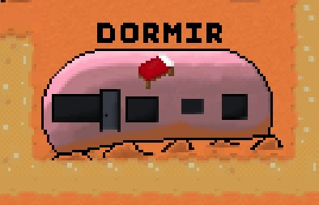

<a name="readme-top"></a>

<!-- LOGO DU PROJET -->
<div align="center">
    
<h3 align="center">MARS'GRICULTURE</h3>
</div>

_Projet_ : Producteurs et consommateurs : les mécanismes du marché face aux changements de contexte

<!-- SOMMAIRE -->
<details>
  <summary>Sommaire</summary>
  <ol>
    <li><a href="#projet-T3">Projet T3</a></li>
    <li><a href="#capture-decran">Captures d'écrans</a>
      <ul>
          <li><a href="#menus">Menus</a></li>
          <li><a href="#map">Éléments de la Map</a></li>
          <li><a href="#differentes-fenetres">Différentes fenêtres</a></li>
          <li><a href="#ecran-de-fin">Écran de fin</a></li>
      </ul>
    </li>
    <li><a href="#lien-de-telechargement">Lien de téléchargement</a></li>
    <li><a href="#procedures-dinstallation-et-dexecution">Procédures d'installation et d'exécution</a>
        <ul>
            <li><a href="#procedures-dinstallation">Procédure d'installation</a></li>
                <ul>
                    <li><a href="#windows">Sous Windows</a></li>
                    <li><a href="#linux">Sous Linux</a></li>
                    <li><a href="#mac">Sous Mac</a></li>
                </ul>            
            <li><a href="#procedures-dexecution">Procédure d'execution</a></li>
        </ul>
    </li>
        <li><a href="#licence">Licence</a></li>
    <li><a href="#meta-todo">Méta-Todo</a></li>
    
  </ol>
</details>

<!-- PROJET T3 -->

## Projet T3

<a name="projet-T3"></a>

Nom du groupe : LE groupe  
Code du groupe : PEC22-T3-A  
Participants :

- FLU Charly
- HOOGLAND Paolo
- MARQUE Elise
- NIEDERBERGER Léo

Lien des consignes : [https://git.unistra.fr/T234/T3](https://git.unistra.fr/T234/T3)

Lien de la doc : [Site internet](https://t3doc.vercel.app)

Avez-vous besoin d'aide? Contactez-nous : cflu@etu.unistra.fr

<!-- CAPTURE D'ECRAN -->

<a name="capture-decran"></a>

## Captures d'écrans

### Menus

<div align="center">

<h6 align="center">Menu principal</h6>
</div>

<div align="center">

<h6 align="center">Choix de la durée de la partie</h6>
</div>

### MAP

<a name="map"></a>

<div align="center">
    
<h6 align="center">Les champs</h6>
</div>

<div align="center">
    
<h6 align="center">Le magasin</h6>
</div>

<div align="center">
    
<h6 align="center">Le marché</h6>
</div>

<div align="center">
    
<h6 align="center">L'inventaire du joueur</h6>
</div>

<div align="center">
    
<h6 align="center">La caravane du joueur</h6>
</div>

<div align="center">
    
<h6 align="center">Les notifications</h6>
</div>

<div align="center">
    
<h6 align="center">Les jours et l'argent du joueur</h6>
</div>

### Différentes fenêtres

<a name="differentes-fenetres"></a>

<div align="center">
    
<h6 align="center">Le magasin</h6>
</div>

<div align="center">
    
<h6 align="center">Le marché</h6>
</div>

<div align="center">
    
<h6 align="center">L'inventaire du joueur</h6>
</div>

<div align="center">
    
<h6 align="center">Les champs</h6>
</div>

<div align="center">
    
<h6 align="center">Les notifications</h6>
</div>

<div align="center">
    
<h6 align="center">Demande au joueur s'il est sûr de quitter</h6>
</div>

### Ecran de fin

<div align="center">

<h6 align="center">Ecran de fin avec le score</h6>
</div>


<p align="right">(<a href="#readme-top">back to top</a>)</p>

<!-- LIEN DE TELECHARGEMENT -->

<a name="lien-de-telechargement"></a>

## Lien de téléchargement

Pour télécharger le jeu, allez sur notre [Git](https://git.unistra.fr/le-groupe1/t3_2022) et téléchargez "setupMars'griculteur.exe" <br>
Vous devez maintenant le lancer en suivant les consignes d'installation précisées ci-dessus. 

<p align="right">(<a href="#readme-top">back to top</a>)</p>

<!-- PROCEDURES D'INSTALLATION ET D'EXECUTION -->

<a name="procedures-dinstallation-et-dexecution"></a>

## Procédures d'installation et d'exécution

<a name="procedures-dinstallation"></a>

### Procédures d'installation

<a name="procedures-dinstallation"></a>

#### Sous Windows

<a name="Windows"></a>

Ouvrez SetupMars'griculteur.exe puis suivez les étapes d'installation. <br> Après, ouvrez l'application créée sur votre Bureau.

#### Sous Linux

<a name="Linux"></a>

Si vous pouvez exécuter des fichiers .exe sur Linux, alors vous n'avez qu'à ouvrir SetupMars'griculteur.exe <br>

Sinon, vous devrez faire quelques manipulations:
- Allez sur votre 
- Installez la commande "wine" avec
```
sudo apt-get install wine
```
- Lancez l'éxecutable avec 
```
wine SetupMars'griculteur.exe
```

#### Sous Mac

<a name="Mac"></a>

Premièrement, veuillez installer Brew : installez-le avec 

```
/bin/bash -c "$(curl -fsSL https://raw.githubusercontent.com/Homebrew/install/HEAD/install.sh)"
```

Par la suite, veuillez installer la commande "unzip" 

```
brew install unzip
```

Après téléchargement, accédez a votre terminal, tapez unzip /lien/Margscriculteur.zip <br> Après avoir dézippé le fichier, cliquez sur Marsgriculteur.exe

### Procédures d'exécution

<a name="procedures-dexecution"></a>

Lancez Marsgriculteur.exe que vous venez de dézipper.

<p align="right">(<a href="#readme-top">back to top</a>)</p>

<!-- LICENCE -->

<a name="licence"></a>

## Licence

### Unity

Mars’griculteur est développé à partir de Unity.
Nous utilisons la version « Unity Personal » qui nous donne tout les droits sur notre application (plus d’information ici), à partir du moment que notre application génère moins de 100 000$ / ans, ce qui est notre cas, car nous voulons que Mars’griculteur soit entièrement gratuit.
Afin de garder la version « Unity Personal », nous ne devons pas non plus déployer notre logiciel sur des plateformes tels que : « Nintendo, PlayStation, ou Xbox » ce qui n’est pas non plus notre cas.
Nous possédons donc les droits sur notre logiciel, et pouvons donc choisir la licence que nous souhaitons lui appliquer.

### Licence SAAS

La licence SAAS (Software as a Service) est une licence pour commercialiser un logiciel en tant qu’application accessible à distance comme un service, par internet. Ce qui n’est pas notre cas.

### Licences libres

Mars’griculeur sera diffusé sous licence libre. Donc nous acceptons que l’utilisateur possède les droits suivant sur notre logiciel :

- Pouvoir exécuter, copier et distribuer sans frais Mars’griculteur.
- Pouvoir accéder au code source de Mars’griculteur, modifier le logiciel -sans barrière technique ou légale- afin de participer au développement de nouvelles fonctionnalités
  Extrait de FUN MOOC, licences libres.

#### Licences de type BSD

Les licences de type BSD (Berkeley Software Distribution License) ne nous ont pas intéressé, car elles n’imposent que la citation de l’auteur lors de la redistribution, permettant alors à un utilisateur de diffuser un logiciel se basant sur le nôtre, et n’utilisant cette fois-ci pas de licence libre.

#### Licences GNU GPL

Les licences GNU GPL se caractérise notamment par le fait d’être copyleft soit : « Le copyleft est un cadre permettant de faire d’un programme un logiciel libre et d’exiger que les versions modifiées ou étendues deviennent elles aussi des logiciels libres. »
Extrait de gnu.org, Licences.
Nous avons convenu que la licence de Mars’griculteur sera copyleft.

#### Différentes licences compatible avec GNU GPL

Il y a plusieurs licences de logiciel libre compatibles avec la GPL, nous allons en citer quelque unes, et expliquer pourquoi nous ne les avons pas retenu.

- La licence Apache 2.0 ne sera pas sélectionnée car c’est pour les gros programmes et nous avons décidé que notre programme n’est pas très volumineux.
- Licences de Python, ne nous concerne pas, nous n’utilisons pas de python.
- Le domaine public, ce n’est techniquement pas une licence, mais nous ne voulons pas céder notre logiciel au domaine public.
- Nous ne prenons pas les licences GNU qui concernent les bibliothèques.
- …

#### Licence GNU GPLv3

La licence GNU GPLv3 est la dernière version de la licence publique générale GNU. C’est une licence de logiciel libre et d’un copyleft (très fort). Elle n’est pas compatible avec la GPLv2. Elle est approuvée par l’OSI (Open Source Initiative). Elle est pérenne, elle est durable. Elle n’est absolument pas permissive. Et elle a une persistance des 4 libertés pour les additions de code. (source : Wikipédia)

#### Conclusion

Suite à l’étude du site du GNU portant sur le GNU GPLv3, nous avons décidé de choisir la licence GNU GPLv3.

(Voir `LICENCE.txt` pour plus d'information)

<p align="right">(<a href="#readme-top">back to top</a>)</p>

<!-- META-TODO -->

<a name="meta-todo"></a>

## Méta-Todo

- [x] Mettre en place son GIT et préparer les milestones
- [x] Acquérir le sujet et définir un objectif pédagogique
- [x] Concevoir un poster qui décrit cet objectif pédagogique
- [x] Définir le type de jeu et les mécanismes d'apprentissage (Septembre)
- [x] Définir la liste des principales fonctionnalités
- [x] Développer ces fonctionnalités
- [x] Evaluation à mi-parcours (Octobre)
- [x] Tester et équilibrer
- [x] Choisir la Licence (Novembre)
- [x] Faire les captures d'écrans + finir l'UML
- [x] Finaliser le git et produire la documentation
- [x] Présenter son jeu et le faire évaluer (Décembre)

<p align="right">(<a href="#readme-top">back to top</a>)</p>
