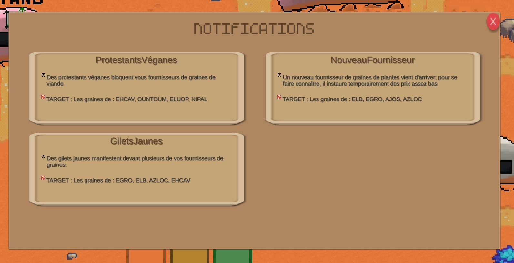

<!-- LOGO DU PROJET -->

    
<h3 align="center">MARS'GRICULTURE</h3>

<!-- SOMMAIRE -->

  
Sommaire

  <ol>
    <li><a href="#deroulement">Déroulement d'une partie</a></li>
    <li><a href="#avancee">Eléments facilitant l’avancée du joueur</a></li>
    <li><a href="#affichage">Eléments facilitant l'affichage du jeu</a></li>
    <li><a href="#comment">Comment jouer?</a></li>
  </ol>

<!-- DEROULEMENT D'UNE PARTIE -->

## Déroulement d’une partie

Mars'griculteur est un jeu de type Tycoon: le joueur incarne un fermier martien, qui doit gérer sa ferme, gérer ses parcelles et vendre ses produits.  
Son but : Atteindre le montant d'argent déterminé le plus rapidement possible.  
Par contre, ceci ne sera pas si facile ! Le joueur s’informe en ligne des événements qui ont lieu sur Mars (ex: arrivée d’une fusée Terrestre, pluie de vaches, etc…) : ces événements affectent les prix des produits et l’état de votre ferme. Le joueur doit être prêt à tout imprévu.   

Le joueur accède à sa ferme, où il procède de la prochaine façon:

- Il regarde les événements en cours et l'évolution des prix dans le marché
- Il achète et plante ses graines selon les prédictions qu’il fait sur la demande
- Il gère son inventaire, ses parcelles ainsi que son argent
- Le joueur peut accéder à son stand, où il fixe le prix de ses produits, puis récupère les bénéfices de ces derniers.

   La partie se termine quand le joueur arrive à son but.

<!-- ELEMENTS FACILITANT L'AVANCEE DU JOUEUR -->

## Éléments facilitant l’avancée du joueur

On utilise les actions suivantes pour que le joueur puisse avancer librement:

- Le jour 1, ses ressources sont minimales, mais suffisantes pour qu'il puisse évoluer rapidement
- L'achat et débloquage des parcelles est explicité par des popups
- L'achat/vente d'éléments est précisé
- Les nouvelles notifications sont visibles à tout moment
- Des messages, tels que "Vous n'avez plus d'argent, vous ne pouvez pas acheter cette graine !", guident le joueur

(<a href="#readme-top">back to top</a>)

<!-- ELEMENTS FACILITANT L'AFFICHAGE DU JEU -->

## Éléments facilitant l’affichage du jeu

Pour que chaque joueur ait la meilleure expérience, on a implémenté ces éléments:

- Affichage des menus en fonction de la taille d’écran
- Inventaires dynamiques
- Interfaces intéractives
- Zoom + Drag and Drop movement

(<a href="#readme-top">back to top</a>)

<!-- COMMENT JOUER? -->

## Comment jouer?

Bienvenus sur Mars'griculteur !   
Vous arrivez sur un Menu qui vous permet de sélectionner un objectif à obtenir, allant de $ 100 000 à $ 1M.  
En cliquant sur jouer, vous arrivez sur une scène martien-nogriculteure ! Vous pouvez cliquer et tirer pour bouger la caméra, ainsi que dézoomer avec la molette.  

Et maintenant? Maintenant, c'est à vous de jouer : vous devez regarder les estimations du marché, puis planifier vos actions (achat de quelle graine? plantation
et vente à quel moment?).

### Comment marche le Stand?

En cliquant sur le stand, vous arrivez sur une interface complexe.
 

    
<h6 align="center">Le marché</h6>

Celle-ci présente un graphe décrivant les fluctuations du marché (de l'élément en question) depuis l'année dernière.
Il vous permet de voir les prix de vente, et ainsi déduire si c'est un bon moment - ou non - pour planter ce produit.  

### Les événements, ils font quoi?

Si vous cliquez sur la cloche, vous rentrez dans une interface qui présente chaque événement en cours.  

    
<h6 align="center">Les notifications</h6>

Ces événements sont des phénomènes martiens, qui sont soit bénéfiques, soit catastrophiques pour votre production.  
C'est à vous d'être intelligent et prévoir un bon plan !
Ces événements sont aléatoires, et peuvent se dérouler pendant plusieurs jours.
De même, plusieurs événements peuvent être simultanés. Cela veut dire que le marché sera aussi dynamique qu'une balançoire à bascule !

### Comment acheter une graine?

Pour acheter une graine, vous n'avez qu'à cliquer sur le Magasin. Celui-ci vous présentera un ensemble de graines (graines végétales et animales - oui, animales! ) que vous pourrez acheter.

    
<h6 align="center">Le magasin</h6>

Un message confirme votre achat, et votre nouvelle graine sera déposée dans votre inventaire.

### Comment planter/récolter une graine?

Pour planter une graine, vous n'avez qu'à cliquer sur une parcelle (ou l'acheter) et cliquer sur la graine que vous voulez planter.

    
<h6 align="center">Les champs</h6>

Celle-ci grandira dès que les jours passent.

### Comment vendre une plante?

Pour vendre une plante/animal, vous devrez retourner sur le market.  
En cliquant sur un produit, étudiant son graphe et en choissisant sa quantité, vous n'avez qu'à cliquer sur "Vendre ! " pour obtenir votre revenu $$$.

### Comment passer au jour suivant?

Lorsque vous avez fini toutes vos actions pour la journée, vous n'avez qu'à cliquer sur votre Caravane/Maison pour dormir!

    
<h6 align="center">La caravane du joueur</h6>

(<a href="#readme-top">back to top</a>)

